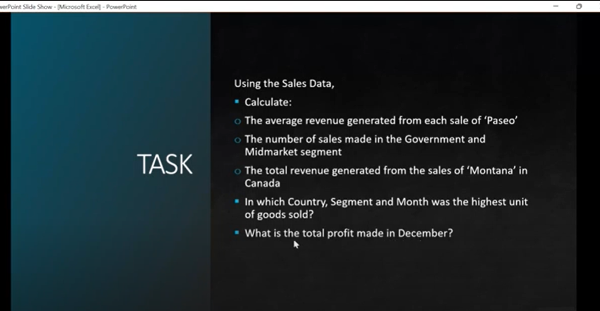
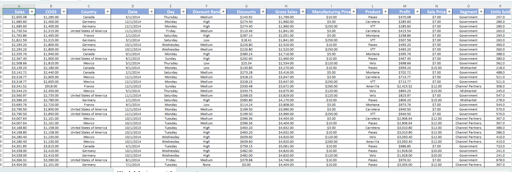
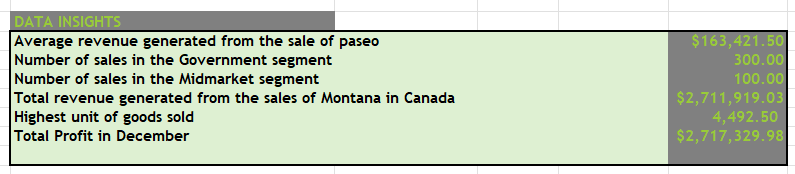
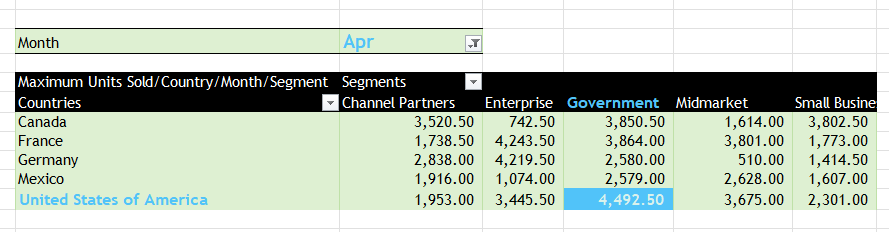

# Analysis On a Company's Financial Data

This is a project demonstrating the analysis of a company's financial data using Excel. The goal is to dig deeper into the data, dissect the information contained, identify patterns, solve problems, and provide insightful recommendations to business stakeholders.

## Introduction:
This is an Excel project on the analysis of a company's financial data. This project aims to use advanced Excel formulars to show trends in a financial data and provide useful insights to stakeholders. it is exciting to use the skills learned to perform data wrangling and analysis.

-Disclaimaer:_ The datasets used for this project are solely made up for the purpose of training.

## Skills/Concepts demonstrated:

Excel functions and formulars Applied:

* Pivot Table
* find and replace
* conditional formatting
* text to column
* sort and filter
* find/replace/select
* data type formatting
* functions e.g [VLOOKUP, XLOOKUP, HLOOKUP, AVERAGEIF, MAXIF, SUMIF, COUNTIF]

## Problem Statement/Questions to be answered:
The following representations were required:

## Data Sourcing
The dataset contained the following information:

Data on net sales, gross sales, discounts, profits, products, transaction dates, country, units sold, manufaturing price, selling prices cost of goods sold, etc.
Overall, there are 702 (including the headers) and 17 columns.
The dataset had just one sheet with all of the data computed.
Six new sheets were added to butress points for the assignmen

## Data Transformation and cleaning

### Step 1:
The company's finacial dataset was cleaned, filtered, and efficiently transformed by aligning texts, checking for duplicates, applying filters, changing the data types for each columns, formatting the headers, and creating mini-functions to check if the values computed in some calculated columns were correct.

### Step 2:
I sought to answer the follwing questions using formulars and pivot tables.

1. The average revenue generated for the product Paseo

2. The number of sales made in the governemnt and midmarket segments

3. The total revenue generated from the sale of Montana in Canada

4. The highest unit of products sold

5. The total profit generated in December

   The table below provides the answers to the questions aforelisted.

### Step 3:
To find the country, segment, and month with the highest unit of goods sold, I used pivot tables to aggregate and filter. 

As demonstrated in the table below (highleted in blue), 
1. The country with the highest unit sold was the United States of America
2. The  seegment with the highest unit sold was the Government segment
3. The Month with the highest unit sold was April

